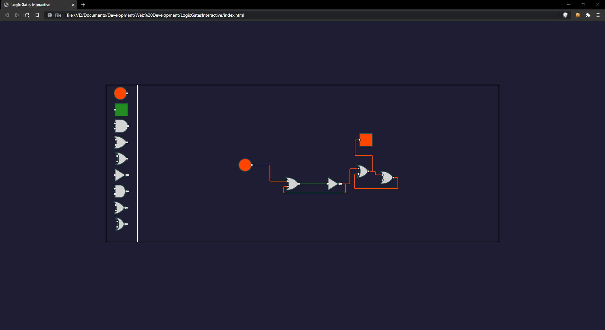

# Logic Gates Interactive
Interactive logic-gates simulation. Made with Go.js

### References
- GoJS v2.0.15 JavaScript Library for HTML Diagrams (Cracked by lckt0)
- https://github.com/NorthwoodsSoftware/GoJS
- https://github.com/sindresorhus/modern-normalize

</img>
</img>
